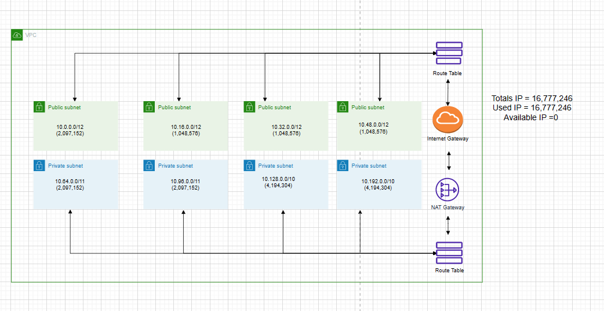
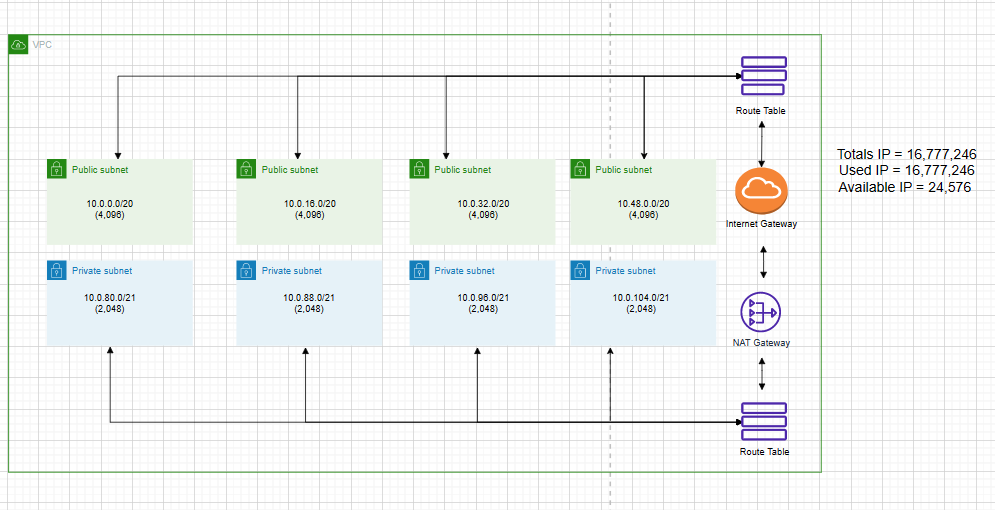

นาย จักรภัทร คำนารักษ์ 6303051623217 เลขที่ 35
**LAB Assignment 5**
### 1.กำหนดให้ VPC มี CIDR range 10.0.0.0/8 จงออกแบบ subnet(vswitch) ตามรายละเอียดดังนี้
    1.1 public 4 zone พร้อมระบุจำนวน ip ที่ใช้ได้
    1.2 private: 4 zone พร้อมระบุจำนวน ip ที่ใช้ได้
    1.3 ระบุจำนวน ip ที่ยังเหลือ
    
* เงื่อนไข: ให้เหลือจำนวน Available IPs น้อยที่สุด

### 2.กำหนดให้ VPC มี CIDR range 10.0.0.0/8 จงออกแบบ subnet(vswitch) ตามรายละเอียดดังนี้
    2.1 public 4 zone พร้อมระบุจำนวน ip ที่ใช้ได้
    2.2 private: 4 zone พร้อมระบุจำนวน ip ที่ใช้ได้
    2.3ระบุจำนวน ip ที่ยังเหลือ
* เงื่อนไข: ให้เหลือจำนวน Available IPs มากที่สุด
