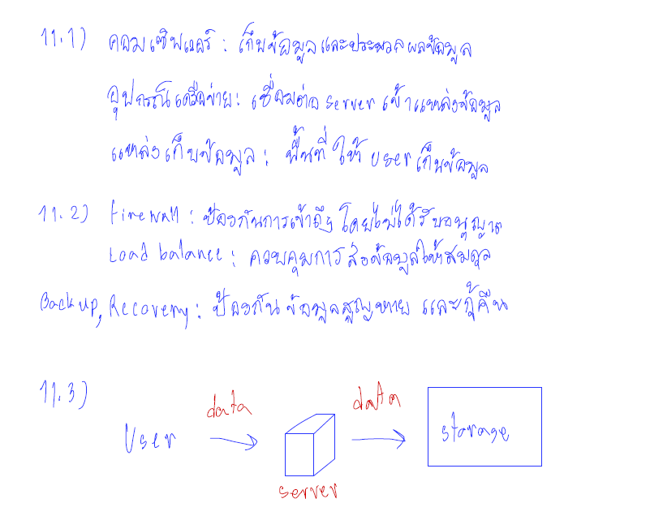

นายจักรภัทร คำนารักษ์ 6303051623217 เลขที่ 35

**Lab Assignment 6**

### 1.กำหนดให้ VPC มี CIDR range 10.0.0.0/8 จงออกแบบ subnet(vswitch) ตามรายละเอียดดังนี้
* public 6 zone พร้อมระบุจำนวน ip ที่ใช้ได้
* private: 6 zone พร้อมระบุจำนวน ip ที่ใช้ได้
* ระบุจำนวน ip ที่ยังเหลือ
* เงื่อนไข: ให้เหลือจำนวน Available IPs น้อยที่สุด

### 2.กำหนดให้ VPC มี CIDR range 172.31.0.0/16 จงออกแบบ subnet(vswitch) ตามรายละเอียดดังนี้
* public 6 zone พร้อมระบุจำนวน ip ที่ใช้ได้
* private: 6 zone พร้อมระบุจำนวน ip ที่ใช้ได้
* ระบุจำนวน ip ที่ยังเหลือ
* เงื่อนไข: ให้เหลือจำนวน Available IPs น้อยที่สุด

### 3. จากคำตอบข้อ 1 และ 2 ให้ตอบคำถามย่อยต่อไปนี้
* 3.1 ต้องใช้ Service อะไรที่ทำให้ VPC จากข้อที่ 1 และ 2 ส่งข้อมูลถึงกันได้
* 3.2 จงวาดตาราง Route Table พร้อมระบุการ ค่าให้เรียบร้อย

### 5. กำหนดให้ VPC A มี CIDR (10.0.0.0/16) และ VPC B  มี CIDR (10.0.0.0/20)จงตอบคำถามต่อไปนี้
*  5.1 VPC A และ VPC B สามารถ peering กันได้หรือไม่ หากไม่ได้จงบอกเหตุผล
* 5.2 กรณีถ้า Peering ได้ จะต้องทำอย่างไร ให้ service ที่อยู่ภายใน VPC ทั้งสองสามารถติดต่อสื่อสารกันได้
* 5.3 ให้วาดรูป architecture ประกอบ

### 6. Hypervisor มีกี่ประเภทแต่ละประเภทคืออะไรบ้าง แล้วประเภทไหนที่ Computer ของเราใช้งานในการเปิด emulator

### 8. ให้ตอบคำถามต่อไปนี้เกี่ยวกับ Debian 
* 8.1 Debian คืออะไร 
* 8.2 version stable ล่าสุดมีชื่อเล่นว่าอะไร
* 8.3 Package Manager ต้องใช้คำสั่งอะไร
* 8.4 หากต้องการติดตั้ง git ควรใช้คำสั่งอะไร

### 9. ให้ตอบคำถามต่อไปนี้เกี่ยวกับ Alpine 
* 9.1 Alpine คืออะไร 
* 9.2 version stable ล่าสุดมีชื่อเล่นว่าอะไร
* 9.3 Package Manager ต้องใช้คำสั่งอะไร
* 9.4 หากต้องการติดตั้ง git ควรใช้คำสั่งอะไร

### 10. ให้ตอบคำถามต่อไปนี้เกี่ยวกับ Amazonlinux 
* 10.1 Amazonlinux คืออะไร 
* 10.2 version stable ล่าสุดมีชื่อเล่นว่าอะไร
* 10.3 Package Manager ต้องใช้คำสั่งอะไร
* 10.4 หากต้องการติดตั้ง git ควรใช้คำสั่งอะไร

### 11. หากเราต้องการสร้างบริษัทเป็นผู้ให้บริการ Cloud จงตอบคำถามต่อไปนี้
* 11.1 เราควรมีอุปกรณ์ Hardware อะไรบ้าง พร้อมอธิบาย 
* 11.2 เราควรมี Software อะไรบ้าง พร้อมอธิบาย
* 11.3 วาดภาพ Architecture ของ Cloud Service ของเรา
* 11.4 ชื่อ Cloud ที่เราให้บริการมีชื่อว่าอะไร
* 11.5 Cloud ของเรามี service อะไร ที่ให้บริการผู้ใช้งานได้บ้าง

